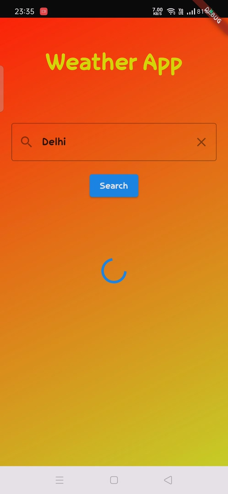
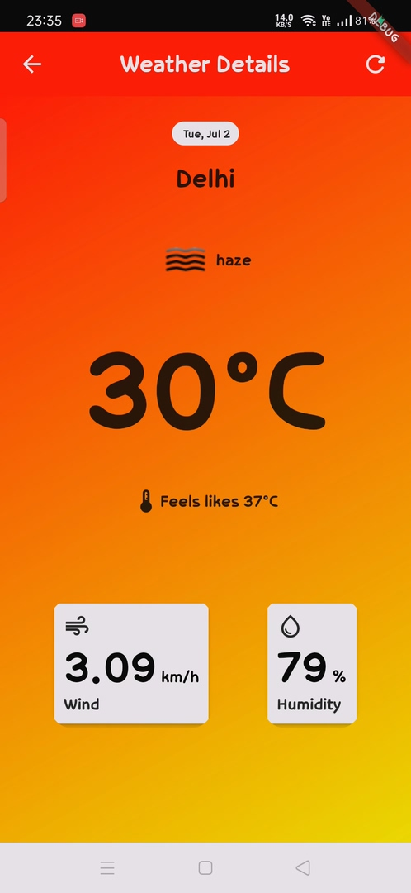
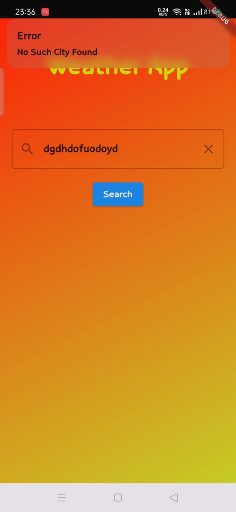

# Weather App

A simple weather app that fetches weather data from OpenWeatherMap API and displays it in a user-friendly format.

## Features

* Search for weather data by city name
* Displays current temperature, weather condition, humidity, and wind speed
* Implements error handling for API requests
* Uses state management to manage app state
* Responsive design for mobile and tablet devices
* Refresh button to fetch updated weather data
* Saves last searched city for future use

## Screenshots

### Home Screen

### Weather Details Screen

### Error Handle Screen

## Working Video Link

https://www.youtube.com/watch?v=LugQuapq270

### Prerequisites

* Create an account on OpenWeatherMap API to get an API key
* Install Flutter and set up your development environment

### Running the App

1. Clone the repository: `git clone https://github.com/KaushikDas9/Weather_App.git`
2. Navigate to the project directory: `cd weather-app`
3. Replace `YOUR_API_KEY` with your actual OpenWeatherMap API key 
4. Run the app: `flutter run`

## Technical Details
--------------------

### API

* Uses OpenWeatherMap API to fetch weather data

### State Management

* Uses GetX for state management

### Error Handling

* Implements error handling for API requests
* Displays user-friendly error messages

### Responsive Design

* Uses Flutter's built-in responsive design features
* Works on both mobile and tablet devices

### Data Persistence

* Saves last searched city using SharedPreferences

## Contributing

Contributions are welcome! If you'd like to contribute to this project, please fork the repository and submit a pull request.

## Acknowledgments

* OpenWeatherMap API for providing free weather data
* Flutter for providing an amazing framework for building cross-platform apps
